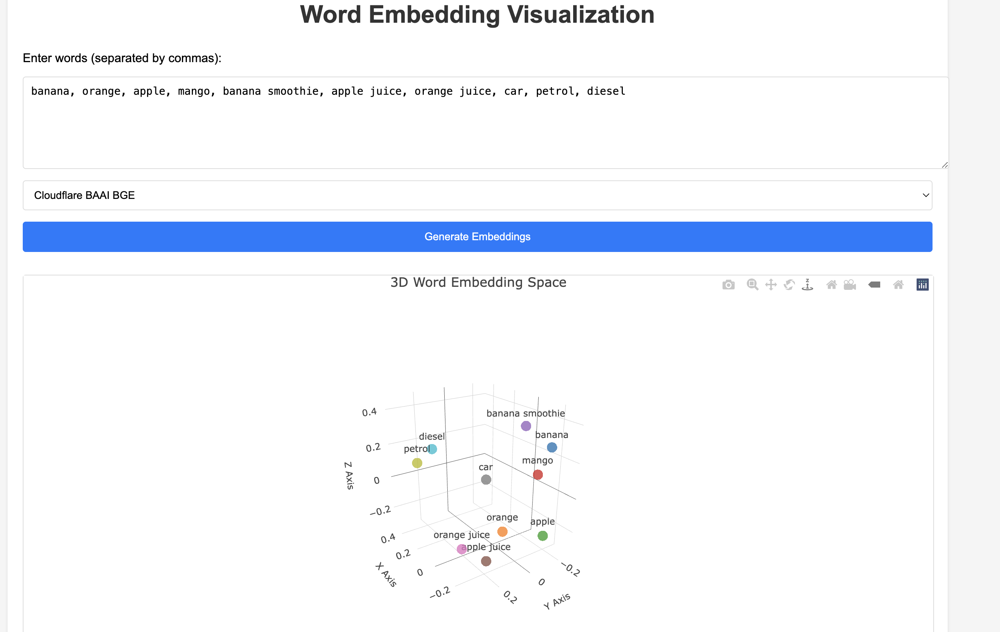

# Embedding Visualization Tool

An interactive web application for visualizing text embeddings from multiple AI models in 3D space. This tool allows you to compare embeddings from OpenAI, Google Gemini, and Cloudflare's BAAI/BGE models.

## Features

- Support for multiple embedding models:
  - OpenAI Ada 002 (1536 dimensions)
  - Google Gemini (768 dimensions)
  - Cloudflare BAAI BGE-Large-EN-V1.5 (1024 dimensions)
- Interactive 3D visualization using Plot.ly
- PCA dimensionality reduction
- Real-time embedding generation
- User-friendly interface

## Prerequisites

- Python 3.11 or higher
- API keys for:
  - OpenAI
  - Google Cloud (with Gemini API access)
  - Cloudflare (with AI Worker access)

## Installation

1. Clone the repository:
```bash
git clone https://github.com/YOUR_USERNAME/embedding_visualization.git
cd embedding_visualization
```

2. Create and activate a virtual environment:
```bash
python -m venv venv
source venv/bin/activate  # On Windows, use: venv\Scripts\activate
```

3. Install dependencies:
```bash
pip install -r requirements.txt
```

4. Create a `.env` file in the project root with your API keys:
```
OPENAI_API_KEY=your_openai_api_key
GOOGLE_API_KEY=your_google_api_key
CLOUDFLARE_API_KEY=your_cloudflare_api_key
CLOUDFLARE_ACCOUNT_ID=your_cloudflare_account_id
```

## Running the Application

1. Ensure your virtual environment is activated:
```bash
source venv/bin/activate  # On Windows, use: venv\Scripts\activate
```

2. Start the Flask server:
```bash
python app.py
```

3. Open your web browser and navigate to:
```
http://localhost:5000
```

## Example


## Tech Stack

- Backend: Flask web framework
- Frontend: HTML, CSS, JavaScript
- Visualization: Plot.ly
- Dimensionality Reduction: PCA (scikit-learn)